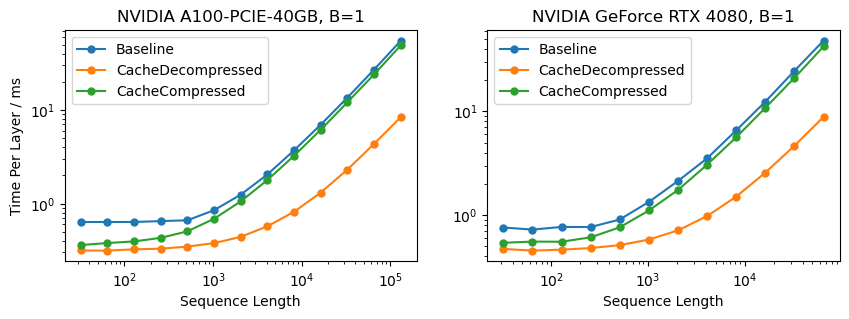
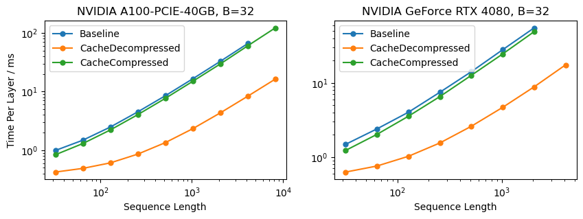
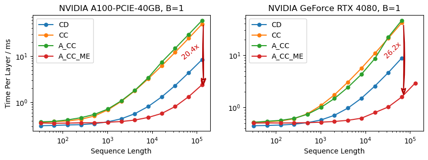
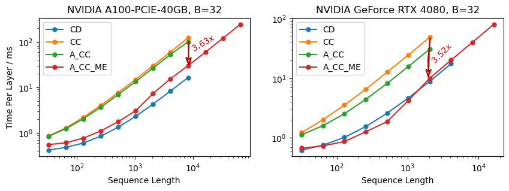
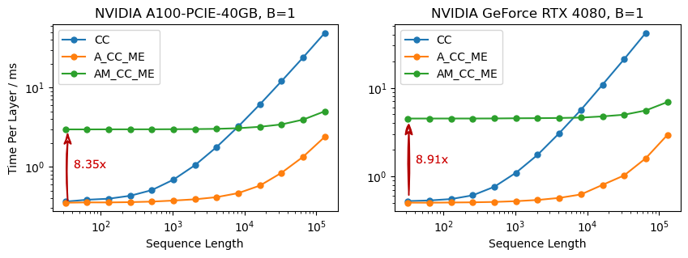

# DeepSeek-V2高性能推理优化笔记：MLA优化

## 前言

最近，幻方发布的DeepSeek-V2模型得到了学术界和产业界的广泛关注。作为一款236B参数的MoE大模型，DeepSeek-V2通过独特的DeepSeekMoE架构设计，每token仅需激活21B的参数，且通过新提出的MLA机制替换传统的MHA和MQA注意力机制，实现了推理过程中的KV Cache大小的大幅降低。因此，DeepSeek-V2能够以较低的推理成本，取得了与GPT-4相当的模型性能。

MLA机制是DeepSeek-V2中的一个核心创新点。作为计算机系统方向的研究人员，我们自然不敢从AI/ML的角度对MLA的算法设计妄加评论，但从System的角度来看，MLA无疑是一个非常优秀的设计。近年来，大模型推理成本居高不下的一大原因就是GPU的算力利用率低下。随着Tensor Core等专门电路的的出现，现代高性能GPU的计算能力已经远高于其内存带宽，GPU每读入的一个字节的数据，往往要参与到数百次计算中，才能保证GPU的计算单元不会空闲，从而取得较好的计算资源利用率（即MFU）。然而，由于多种因素的限制，大模型推理的任务负载通常难以提供如此高的计算强度，即GPU读入的参数未参与足够多次的计算便要被丢弃而读入下一个参数，这导致显存带宽成为了整个推理过程的性能瓶颈。这其中的一大障碍就是KV Cache的空间占用问题：GPU的显存空间往往非常有限，较大的KV Cache会导致同时处理的request数量变少，也即batch size较小；以vLLM为代表的一众工作就是从这个角度入手，优化KV Cache的显存利用，从而提高推理过程的效率。另一方面，针对传统的MHA或GQA算子，在计算注意力的过程中，所有KV Cache中的数据读取后都仅参与一次或几次计算，导致该算子的MFU极低，并且由于每个request有自己的KV Cache，这一问题无法通过提高batch size的方式解决。而MLA算子，从其计算特征来看，同时解决了这两方面的问题：一方面，通过低秩压缩大幅降低了KV Cache的大小，另一方面，MLA解压缩后的多头注意力机制能够提供较高的计算强度，有助于充分利用GPU的算力资源。很明显，MLA算子是针对现代GPU硬件特点“量体裁衣”定制的一个注意力机制，通过对存储和计算的再平衡，能够充分发挥现代GPU的各项优势。

DeepSeek-V2开源的代码中未对MLA算子进行过多的优化。我们尝试复现了一些MLA算子在推理阶段（具体来说，是推理阶段中的decoding阶段）可能涉及的优化点，并对其进行了评测和分析。

本文中所涉及的全部代码的地址：https://github.com/madsys-dev/deepseekv2-profile 

## MLA模块的计算过程

给定输入向量$h_t \in \mathbb{R}^{B \times L \times 5120}$，其中$B$为batch size，$L$为sequence length，MLA的计算过程如下。

### Q向量

在DeepSeek-V2中，Q向量也采用了低秩压缩的方式。首先，将输入向量投影到一个1536维的低维空间：
$$ c_t^Q = W^{DQ} h_t \in \mathbb{R}^{B \times L \times 1536} $$
然后，将其投影到$\mathbb{R}^{H \times 128}$的多头向量空间上（其中$H=128$是heads数），得到了Q向量的第一部分：
$$ q_t^C = W^{UQ} c_t^Q \in \mathbb{R}^{B \times L \times H \times 128} $$
再将其投影到$\mathbb{R}^{H \times 64}$上并使用RoPE嵌入位置信息，得到Q向量的第二部分：
$$ q_t^R = \mathrm{RoPE}(W^{KR} h_t) \in \mathbb{R}^{B \times L \times H \times 64} $$
将两部分拼接的到最终的Q向量：
$$ q_t = [q_t^C, q_t^R] \in \mathbb{R}^{B \times L \times H \times 192} $$

### KV向量

计算KV向量时，首先需要将输入向量投影为512维的联合压缩表示：
$$ c_t^{KV} = W^{DKV} h_t \in \mathbb{R}^{B \times L \times 512} $$

与Q向量的计算过程类似，K向量的第一部分是将$c_t^{KV}$通过投影解压缩到$\mathbb{R}^{H \times 128}$的多头向量空间：
$$ k_t^C = W^{UK} c_t^{KV} \in \mathbb{R}^{B \times L \times H \times 128} $$
K的第二部分是将输入向量投影到64维向量空间并施加RoPE嵌入位置信息：
$$ k_t^R = \mathrm{RoPE}(W^{KR} h_t) \in \mathbb{R}^{B \times L \times 64} $$
与Q不同的是，完整的K是将K的第二部分广播到每个head后与第一部分拼接得到：
$$ k_t = \begin{bmatrix}
    k_{t,1}^C & k_t^R \\ 
    k_{t,2}^C & k_t^R \\
    \vdots & \vdots \\
    \end{bmatrix} \in \mathbb{R}^{B \times L \times H \times 192} $$
也就是说，每个head的RoPE部分是完全相同的。

V向量的计算较为简单，直接将$c_t^{KV}$解压缩到$\mathbb{R}^{H \times 128}$即可：
$$ v_t = W^{UV} c_t^{KV} \in \mathbb{R}^{B \times L \times H \times 128} $$

### Attention计算

Attention的计算过程和传统的MHA并无差异。首先计算attention score：
$$ a = \mathrm{softmax}\left(\frac{q_t^\top k_t + \mathrm{Mask}}{\sqrt{192}}\right) = 
\mathrm{softmax}\left(\frac{{q_t^C}^\top k_t^C + {q_t^R}^\top k_t^R + \mathrm{Mask}}{\sqrt{128 + 64}} \right)
\in \mathbb{R}^{B \times L \times H \times L} $$
计算对V的加权和，并将所有head压平，得到Attention输出：
$$ o = a \cdot v_t \in \mathbb{R}^{B \times L \times H \times 128} \cong \mathbb{R}^{B \times L \times 16384} $$
经过另一个矩阵的投影，就能得到MLA的最终输出：
$$ u = W^O o \in \mathbb{R}^{B \times L \times 5120} $$

## 开源代码MLA分析

``` python
def forward(...):
    bsz, q_len, _ = hidden_states.size()
    
    # 计算Q：先降维再升维，好处是相比直接使用大小为 [5120, 24576] 的矩阵
    # [5120, 1536] * [1536, 24576] 这样的低秩分解在存储空间和计算量上都大幅度降低
    q = self.q_b_proj(self.q_a_layernorm(self.q_a_proj(hidden_states)))
    q = q.view(bsz, q_len, self.num_heads, self.q_head_dim).transpose(1, 2)
    # 切分 rope 和非 rope 部分
    q_nope, q_pe = torch.split(
        q, [self.qk_nope_head_dim, self.qk_rope_head_dim], dim=-1
    )
    
    # 计算KV
    # 一个优化的 MLA KVCache 实现只需要缓存这个 compressed_kv 就行，不过后面实际上展开了
    compressed_kv = self.kv_a_proj_with_mqa(hidden_states)
    # 此处compressed_kv 对应公式中的 c_t^{KV}
    compressed_kv, k_pe = torch.split(
        compressed_kv, [self.kv_lora_rank, self.qk_rope_head_dim], dim=-1
    )
    k_pe = k_pe.view(bsz, q_len, 1, self.qk_rope_head_dim).transpose(1, 2)
    # 将 MLA 展开成标准 MHA 的形式
    kv = (
        self.kv_b_proj(self.kv_a_layernorm(compressed_kv))
        .view(bsz, q_len, self.num_heads, self.qk_nope_head_dim + self.v_head_dim)
        .transpose(1, 2)
    )
    # 因为 kv_b_proj 打包了 W^{UK} 和 W^{UV} 把他们分离出来
    k_nope, value_states = torch.split(
        kv, [self.qk_nope_head_dim, self.v_head_dim], dim=-1
    )
    ...
    # 给需要 rope 的部分加 rope
    q_pe, k_pe = apply_rotary_pos_emb(q_pe, k_pe, cos, sin, position_ids)
    
    # 更新和拼接历史 KVCache，可以看到这里存储的是展开后的 MHA KVCache
    # 其中 q_head_dim 等于 qk_nope_head_dim + qk_rope_head_dim
    query_states = k_pe.new_empty(bsz, self.num_heads, q_len, self.q_head_dim)
    query_states[:, :, :, : self.qk_nope_head_dim] = q_nope
    query_states[:, :, :, self.qk_nope_head_dim :] = q_pe
    key_states = k_pe.new_empty(bsz, self.num_heads, q_len, self.q_head_dim)
    key_states[:, :, :, : self.qk_nope_head_dim] = k_nope
    key_states[:, :, :, self.qk_nope_head_dim :] = k_pe
    if past_key_value is not None:
        cache_kwargs = {"sin": sin, "cos": cos}  # Specific to RoPE models
        key_states, value_states = past_key_value.update(
            key_states, value_states, self.layer_idx, cache_kwargs
        )

    # 后续就是标准的 MHA 代码，不再赘述
    ...
```

## MLA模块的实现优化

### KV Caching

在原始的transformer模型的decoding过程中，每次迭代都需要计算所有token对应的的KV向量，这部分的计算往往会带来较大的开销。实际上，每次迭代过程中，这些KV向量的值都是一样的；因此，我们可以采用“空间换时间”的策略，将先前迭代过程中KV向量的值缓存下来，这样在后续的迭代过程中，就不需要重复计算KV向量了，从而大大减小了模型推理过程中的计算量。

然而，在以MHA为代表的传统Attention算子中，这种空间换时间的策略往往会矫枉过正。由于KV cache占用的空间很大，并且KV cache中的数据在每次迭代过程中仅参与一次计算，在使用KV cache后，虽然计算量减小了，但是显存占用量以及显存带宽需求却急剧上升，成为了制约大模型推理效率的新瓶颈。MLA的设计通过多头共用压缩后的KV表示，一方面大幅减少了KV cache的占用，另一方面，由于Compressed KV在每个head中都参与了计算，DeepSeek-V2的128个heads能够提供足够的计算强度，因此Attention部分的MFU也得到了大幅提高。

在开源的版本中， MLA算子了完整的KV Cache，丧失了MLA的上述种种好处。我们尝试改为缓存压缩后的KV Cache，并与缓存完整的KV Cache进行对比。当然，此处我们也将RoPE后的k_pe一并缓存入KV Cache中。

``` python
# CacheCompressed
def forward(self, hidden_states_q: torch.Tensor, q_position_ids: torch.LongTensor, compressed_kv: torch.Tensor):
    ...
    kv_seq_len = compressed_kv.size(1)
    compressed_kv, k_pe = torch.split(
        compressed_kv, [self.kv_lora_rank, self.qk_rope_head_dim], dim=-1
    )
    k_pe = k_pe.view(bsz, kv_seq_len, 1, self.qk_rope_head_dim).transpose(1, 2)
    kv = self.kv_b_proj(compressed_kv) \
        .view(bsz, kv_seq_len, self.num_heads, self.qk_nope_head_dim + self.v_head_dim) \
        .transpose(1, 2)
    
    k_nope, value_states = torch.split(kv, [self.qk_nope_head_dim, self.v_head_dim], dim=-1)
    ... 
```

两种实现的KV Cache占用和计算量如下表：

| 实现版本 | 每token每层Cache大小 | 每token每层计算量 |
| :---: | :---: | :---: |
| CacheDecompressed (CD) | 81.92 kB | 0.08 MFLOP |
| CacheCompressed (CC) | 1.152 kB | 33.64 MFLOP |

可以看到，CacheDecompressed策略虽然可以节省几乎全部的浮点计算量，但其显存占用量却达到了81.92kB每token。这使得CacheDecompressed的瓶颈很容易卡在显存容量和显存带宽上。而CacheCompressed的显存占用却少了约98.6%。因此，我们可以期望CacheCompressed策略能够更加均衡的利用GPU的各项硬件能力，并且提供更大的batch size，从而降低推理成本。

我们分别在A100-PCIe-40G（Compute80架构）和GeForce RTX 4080（Compute89架构）上对上述实现进行性能测试。对于单个request，各种实现的性能表现如下图所示：



CacheDecompressed的性能明显好于CacheCompressed。这说明，CacheCompressed策略还需进一步优化，降低per token的计算量，才能取得较好的性能。

当Batch Size=32时，各实现的性能如下图所示：



测试结果基本和单个查询时的相同。

### Projection Absorption

上述分析和实验结果表明，相比缓存完整的KV Cache，缓存压缩后的KV Cache会带来较大的性能下降。另外一个重要的问题是，当前的CacheCompressed实现实际上并不能缓解KV Cache过大的问题，这是由于在计算MLA的时候，仍然需要存储解压后的完整的KV Cache，这很可能引起OOM崩溃。

所幸DeepSeek-V2的论文中提出，可以将KV的解压缩矩阵吸收到Q-projection和Out-projection中，从而可以在不解压缩KV Cache的情况下直接计算最终的Attention结果。
对于K的吸收，在Attention Score的计算公式中，非RoPE部分可以做如下展开：
$$
{q_t^C}^\top k_t^C = (W^{UQ} c_t^Q)^{\top} W^{UK} c_t^{KV} = {c_t^Q}^{\top}{W^{UQ}}^{\top} W^{UK} c_t^{KV} = ({c_t^Q}^{\top}{W^{UQ}}^{\top} W^{UK}) c_t^{KV} 
$$
即通过矩阵乘法结合律，可以改为计算$({c_t^Q}^{\top}{W^{UQ}}^{\top} W^{UK})$，避免了解压缩出完整的K矩阵。此外，在原始版本的解压缩的过程中，由于每个token的key都需要与$W^{UK}$相乘才能得到，因此计算量较大；矩阵吸收后，$W^{UK}$只需要对$q_t^C$这一个向量相乘，也大大减少了浮点计算量。

对于V的吸收，情况稍微复杂。为表述的清楚性，我们采用Einstein求和约定描述该过程：
``` python
v_t = einsum('hdc,blc->blhd', W_UV, c_t_KV) # (1)
o   = einsum('bqhl,blhd->bqhd', a, v_t)     # (2)
u   = einsum('hdD,bhqd->bhD', W_o, o)       # (3)

# 将上述三式合并，得到总的计算过程
u   = einsum('hdc,blc,bqhl,hdD->bhD', W_UV, c_t_KV, a, W_o)

# 利用结合律改变计算顺序
o_  = einsum('bhql,blc->bhqc', a, c_t_KV) # (4)
o   = einsum('bhqc,hdc->bhqd', o_, W_UV)  # (5)
u   = einsum('hdD,bhqd->bhD', W_o, o)     # (6)
```

具体的代码实现如下：
``` python
# Absorbed_CacheCompressed
def forward(hidden_states_q: torch.Tensor, q_position_ids: torch.LongTensor, compressed_kv: torch.Tensor):
    ...
    kv_b_proj = self.kv_b_proj.weight.view(self.num_heads, -1, self.kv_lora_rank)
    q_absorb = kv_b_proj[:, :self.qk_nope_head_dim,:]
    out_absorb = kv_b_proj[:, self.qk_nope_head_dim:, :]
    
    cos, sin = self.rotary_emb(q_pe)
    q_pe = apply_rotary_pos_emb(q_pe, cos, sin, q_position_ids)
    
    qk_head_dim = self.kv_lora_rank + self.qk_rope_head_dim
    query_states = k_pe.new_empty(bsz, self.num_heads, q_len, qk_head_dim)
    # 此处改变了q_nope的计算顺序
    query_states[:, :, :, : self.kv_lora_rank] = torch.einsum('hdc,bhid->bhic', q_absorb, q_nope)
    query_states[:, :, :, self.kv_lora_rank :] = q_pe
    
    ...

    attn_weights = nn.functional.softmax(
        attn_weights, dim=-1, dtype=torch.float32
    ).to(q_nope.dtype)
    # 此处改变了attn_output的计算顺序
    attn_output = torch.einsum('bhql,blc->bhqc', attn_weights, compressed_kv)
    attn_output = torch.einsum('bhqc,hdc->bhqd', attn_output, out_absorb)

    if attn_output.size() != (bsz, self.num_heads, q_len, self.v_head_dim):
        raise ValueError(
            f"`attn_output` should be of size {(bsz, self.num_heads, q_len, self.v_head_dim)}, but is"
            f" {attn_output.size()}"
        )

    attn_output = attn_output.transpose(1, 2).contiguous()
    attn_output = attn_output.reshape(bsz, q_len, self.num_heads * self.v_head_dim)
    attn_output = self.o_proj(attn_output)
```

#### Move Elision
不过，这样还不能完全发挥出MLA的威力。在原始代码中，query_states和key_states会通过拼接RoPE和非RoPE部分得到：
``` python
def forward(...):
    ...
    query_states = k_pe.new_empty(bsz, self.num_heads, q_len, self.q_head_dim)
    query_states[:, :, :, : self.qk_nope_head_dim] = q_nope
    query_states[:, :, :, self.qk_nope_head_dim :] = q_pe

    key_states = k_pe.new_empty(bsz, self.num_heads, kv_seq_len, self.q_head_dim)
    key_states[:, :, :, : self.qk_nope_head_dim] = k_nope
    key_states[:, :, :, self.qk_nope_head_dim :] = k_pe
    ...
```
当我们采取了上述优化后，此处的拼接过程会产生大量无用的数据拷贝和广播，同时也会占用大量显存空间导致OOM。为此，我们采用MoveElision优化策略，
即省略此处的拼接RoPE部分和非RoPE部分的过程，而是直接分别计算量部分的额Attention Score并相加（考虑$q_t^\top k_t = {q_t^C}^\top k_t^C + {q_t^R}^\top k_t^R$）：
``` python
# Absorbed_CacheCompressed_MoveElision
def forward(...):
    ...
    # qk_head_dim = self.kv_lora_rank + self.qk_rope_head_dim
    # query_states = k_pe.new_empty(bsz, self.num_heads, q_len, qk_head_dim)
    # query_states[:, :, :, : self.kv_lora_rank] = torch.einsum('hdc,bhid->bhic', q_absorb, q_nope)
    # query_states[:, :, :, self.kv_lora_rank :] = q_pe

    # key_states = k_pe.new_empty(bsz, self.num_heads, kv_seq_len, qk_head_dim)
    # key_states[:, :, :, : self.kv_lora_rank] = compressed_kv.unsqueeze(1)
    # key_states[:, :, :, self.kv_lora_rank :] = k_pe

    # attn_weights = torch.matmul(query_states, key_states.transpose(2, 3)) * self.softmax_scale

    attn_weights = torch.matmul(q_pe, k_pe.transpose(2, 3)) + torch.einsum('bhqc,blc->bhql', q_nope, compressed_kv)
    attn_weights *= self.softmax_scale
    ...
```

这样，我们得到了以下四个版本的优化实现：

| 实现版本 | 每token每层Cache大小 | 每token每层计算量 |
| :---: | :---: | :---: |
| CacheDecompressed (CD) | 81.92 kB | 0.08 MFLOP |
| CacheCompressed (CC) | 1.152 kB | 33.64 MFLOP |
| Absorbed_CacheCompressed (A_CC) | 1.152 kB | 0.28 MFLOP |
| Absorbed_CacheCompressed_MoveElision (A_CC_ME) | 1.152 kB | 0.28 MFLOP |

在A100-PCIe-40G和GeForce RTX 4080上的测试结果如下，与理论分析完全相符。





值得注意的是，当采用MoveElision策略后，由于显存占用的减少，可以处理的batch size和sequence length得以明显增加，充分体现出了MLA的压缩表示的优势。

#### Materializing Projection Matrices?

DeepSeek-V2的论文中说：
> ..., we can absorb $W^{UK}$ into $W^{UQ}$, and $W^{UV}$ into $W^O$.

不过，我们似乎并没有必要再改变顺序，对模型参数进行预处理，将$W^{UK}$与$W^{UQ}$相乘，以及将$W^{UV}$与$W^O$相乘。这是因为，$W^{UK}$与$W^{UQ}$相乘后的结果可以视为$H$个大小为$1536 \times 512$的低秩（不超过128）矩阵，而$W^{UV}$与$W^O$相乘的结果可以视为$H$个大小为$5120 \times 512$的低秩矩阵。相比用这些特别大的低秩矩阵做投影，明显不如按照低秩分解形式依次相乘来得划算。因此，我们认为这一步的优化并不是很有必要。

我们实现了这一优化版本（AM_CC_ME），并进行了测试。测试结果能够印证我们的观点。




该优化后的性能明显不如原来的版本，尤其是当sequence length较小，这些投影的计算时间占主导时，性能差距尤甚。

## 后续优化

目前的代码实现是基于矩阵乘法实现的，因此在计算过程中会需要完整的算出来 attention score 矩阵。如需进一步优化，可以考虑类似FlashAttention的做法，即一次性读入整个KV-pair进行计算。由于MLA的K和V是共享同一个压缩表示（实际上，上述优化过的MLA实现非常类似于满足$K=V$的MQA），这样可以进一步减少显存读取，提高计算强度。
